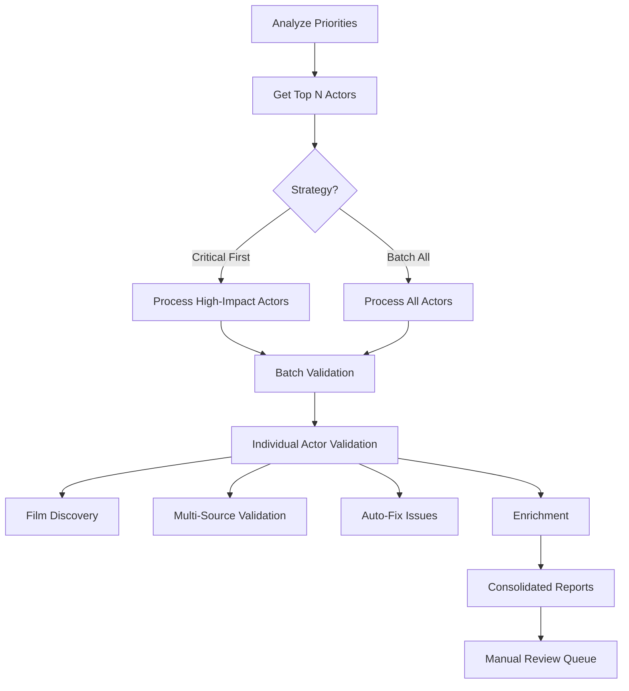

# Batch Actor Validation System

## Overview

Systematic validation and enrichment for ALL actors in the database using the comprehensive `validate-actor-complete.ts` system.

## Architecture



## Components

### 1. **Priority Analyzer** (`analyze-actor-priorities.ts`)
Analyzes all actors and ranks them by:
- Movie count (impact)
- Data completeness
- Missing critical fields
- TMDB linking status

**Output**: Prioritized CSV with recommendations

### 2. **Batch Processor** (`batch-validate-all-actors.ts`)
Processes actors in batches using `validate-actor-complete.ts`:
- Configurable batch sizes
- Progress tracking & resume
- Error handling & retry
- Consolidated reporting

### 3. **Actor Validator** (`validate-actor-complete.ts`)
Comprehensive validation per actor:
- Film discovery (9+ sources)
- Ghost entry detection
- TMDB ID validation
- Missing film detection
- Technical credits enrichment
- Auto-fix with confidence thresholds

---

## Quick Start

### Step 1: Analyze Priorities (5 min)

```bash
# Analyze all actors and get prioritized list
npx tsx scripts/analyze-actor-priorities.ts

# Focus on top 20 actors
npx tsx scripts/analyze-actor-priorities.ts --top=20

# Only actors with 10+ movies
npx tsx scripts/analyze-actor-priorities.ts --min-movies=10
```

**Output**: `docs/actor-priority-analysis.csv`

Review the CSV to decide your strategy:
- **Critical actors** (<70% complete) → Process first
- **High-priority actors** (70-89% complete) → Enrichment focus
- **Low-priority actors** (90%+ complete) → Quick audit only

---

### Step 2: Choose Processing Strategy

#### Strategy A: Critical Actors First (Recommended)

Process the top 10 critical actors from your analysis:

```bash
# Example: Top 10 from analysis
npx tsx scripts/batch-validate-all-actors.ts \
  --actors="Chiranjeevi,Mahesh Babu,Prabhas,Allu Arjun,Jr NTR,Ram Charan,Venkatesh,Nagarjuna,Nani,Pawan Kalyan" \
  --mode=full \
  --batch-size=5
```

**Time**: ~2-3 hours for 10 actors (high movie count)

#### Strategy B: Process All Actors in Batches

```bash
# Start with report-only mode (dry run)
npx tsx scripts/batch-validate-all-actors.ts \
  --mode=report \
  --batch-size=10 \
  --min-movies=5

# Then execute with enrichment
npx tsx scripts/batch-validate-all-actors.ts \
  --mode=full \
  --batch-size=5 \
  --min-movies=5
```

**Time**: ~30-50 hours for all actors (depends on total count)

#### Strategy C: Resume from Checkpoint

```bash
# Resume from specific actor
npx tsx scripts/batch-validate-all-actors.ts \
  --mode=full \
  --resume-from="Actor Name"

# Auto-resume from last checkpoint
npx tsx scripts/batch-validate-all-actors.ts \
  --mode=full \
  --resume
```

---

## Mode Options

### `--mode=report` (Dry Run)
- **What it does**: Analyzes and reports issues only
- **Changes**: None (read-only)
- **Duration**: ~30-60 seconds per actor
- **Use when**: First-time analysis, checking scope

### `--mode=execute` (Fix + Enrich)
- **What it does**: Auto-fixes high-confidence issues + enrichment
- **Changes**: Fixes duplicates, adds missing data, TMDB linking
- **Duration**: ~2-5 minutes per actor
- **Use when**: Ready to improve data quality

### `--mode=full` (Complete Pipeline)
- **What it does**: Discovery → Validation → Fix → Enrich → Export
- **Changes**: Everything (comprehensive)
- **Duration**: ~5-10 minutes per actor (high movie count)
- **Use when**: Complete filmography validation needed

---

## Configuration Options

### Batch Control
```bash
--batch-size=10          # Number of actors per batch
--batch-delay=5000       # Delay between actors (ms)
--min-movies=5           # Only process actors with 5+ movies
```

### Actor Selection
```bash
--actors="Actor1,Actor2" # Process specific actors only
--resume-from="Actor"    # Resume from specific actor
--resume                 # Auto-resume from checkpoint
```

### Output
```bash
--output-dir=docs/batch  # Custom output directory
--language=Telugu        # Language filter
```

---

## Output Files

### Per Actor (from `validate-actor-complete.ts`)
```
docs/{actor-slug}-enhanced-anomalies.csv    # Issues detected
docs/{actor-slug}-enhanced-anomalies.json   # Detailed report
docs/{actor-slug}-final-filmography.csv     # Complete filmography (if --export)
docs/{actor-slug}-final-filmography.json    # API-ready format
docs/{actor-slug}-final-filmography.md      # Human-readable
```

### Batch Summary (from `batch-validate-all-actors.ts`)
```
docs/batch-actor-validation/
  ├── batch-progress.json           # Real-time progress
  ├── batch-summary.json            # Final summary
  └── batch-validation-results.csv  # All results consolidated
```

---

## Example Workflows

### Workflow 1: High-Impact Actors (Top 10)

**Goal**: Fix data quality for most-viewed actors

```bash
# Step 1: Identify top 10
npx tsx scripts/analyze-actor-priorities.ts --top=10

# Step 2: Process them
npx tsx scripts/batch-validate-all-actors.ts \
  --actors="$(head -2 docs/actor-priority-analysis.csv | tail -1 | cut -d',' -f2)" \
  --mode=full
```

**Expected**: 
- ~2-3 hours processing
- 500-1000+ movies improved
- 90%+ data completeness

---

### Workflow 2: All Actors (Comprehensive)

**Goal**: Complete database validation

```bash
# Step 1: Analyze all
npx tsx scripts/analyze-actor-priorities.ts --min-movies=5

# Step 2: Report-only first
npx tsx scripts/batch-validate-all-actors.ts \
  --mode=report \
  --min-movies=5 \
  --batch-size=20

# Step 3: Review reports, then execute
npx tsx scripts/batch-validate-all-actors.ts \
  --mode=full \
  --min-movies=5 \
  --batch-size=5

# Step 4: If interrupted, resume
npx tsx scripts/batch-validate-all-actors.ts \
  --mode=full \
  --resume
```

**Expected**:
- ~30-50 hours total
- All actors validated
- Database-wide quality improvement

---

### Workflow 3: Incremental Processing

**Goal**: Process 10 actors per day

```bash
# Day 1: Actors 1-10
npx tsx scripts/batch-validate-all-actors.ts \
  --actors="Actor1,Actor2,...,Actor10" \
  --mode=full

# Day 2: Actors 11-20
npx tsx scripts/batch-validate-all-actors.ts \
  --resume-from="Actor11" \
  --mode=full
  
# ... continue daily
```

**Expected**:
- ~1 hour per day
- Complete in 1-2 weeks (for ~100 actors)

---

## Monitoring & Troubleshooting

### Check Progress
```bash
# View current progress
cat docs/batch-actor-validation/batch-progress.json | jq '.processed, .totalActors'

# See failures
cat docs/batch-actor-validation/batch-validation-results.csv | grep Failed
```

### Handle Failures

If an actor fails:
1. **Check the error** in `batch-validation-results.csv`
2. **Run manually** to see detailed output:
   ```bash
   npx tsx scripts/validate-actor-complete.ts --actor="Failed Actor" --full
   ```
3. **Fix the issue** (e.g., network timeout, API limit)
4. **Resume batch** from that actor:
   ```bash
   npx tsx scripts/batch-validate-all-actors.ts --resume-from="Failed Actor" --mode=full
   ```

### Common Issues

| Issue | Solution |
|-------|----------|
| **Network timeout** | Increase `--batch-delay` to 10000ms |
| **API rate limit** | Use `--mode=report` first, then `--mode=execute` |
| **Out of memory** | Reduce `--batch-size` to 3-5 |
| **Process interrupted** | Use `--resume` flag to continue |
| **Too slow** | Process only critical actors first |

---

## Performance Metrics

### Processing Speed (Per Actor)

| Mode | High-Count Actor (50+ movies) | Medium-Count (10-50) | Low-Count (<10) |
|------|-------------------------------|----------------------|-----------------|
| Report | 1-2 min | 30-60 sec | 20-30 sec |
| Execute | 3-5 min | 2-3 min | 1-2 min |
| Full | 8-12 min | 5-8 min | 3-5 min |

### Batch Estimates

| Batch Size | Actors | Mode | Total Time |
|------------|--------|------|------------|
| 10 | 10 critical | Full | ~2-3 hours |
| 5 | 50 all | Full | ~8-12 hours |
| 10 | 100 all | Report | ~2-3 hours |
| 5 | 100 all | Full | ~20-30 hours |

---

## Best Practices

### 1. **Start Small**
- Run analysis first
- Process top 5 actors to validate system
- Check outputs before scaling

### 2. **Use Report Mode First**
- Understand scope of issues
- Estimate processing time
- Identify potential problems

### 3. **Process in Stages**
```bash
# Stage 1: Critical actors (highest impact)
--actors="Top10Critical" --mode=full

# Stage 2: High-priority (enrichment)
--min-movies=20 --mode=execute

# Stage 3: Medium-priority (quick fixes)
--min-movies=10 --mode=execute

# Stage 4: Low-priority (audit only)
--min-movies=5 --mode=report
```

### 4. **Monitor Resource Usage**
- Network bandwidth (API calls)
- CPU usage (concurrent processing)
- Disk space (reports/exports)

### 5. **Schedule Appropriately**
- Long batches: Run overnight
- Resume checkpoints: Use for multi-day processing
- API limits: Spread across days if needed

---

## Integration with Database Audit

### Combined Workflow

```bash
# 1. Database-level audit (identifies issues)
npx tsx scripts/audit-database-integrity.ts

# 2. Analyze actor priorities (plan processing)
npx tsx scripts/analyze-actor-priorities.ts

# 3. Batch process critical actors (fix issues)
npx tsx scripts/batch-validate-all-actors.ts --mode=full

# 4. Re-run database audit (verify improvements)
npx tsx scripts/audit-database-integrity.ts
```

---

## Success Criteria

After batch processing, expect:

### Data Quality Metrics
- **Completeness**: 85%+ (up from ~70%)
- **TMDB Linking**: 90%+ actors linked
- **Directors**: 95%+ movies have directors
- **Posters**: 90%+ movies have images
- **Synopsis**: 80%+ movies have descriptions

### Issues Resolved
- Duplicates: 95%+ detected and merged
- Ghost entries: 100% re-attributed or removed
- Missing films: 90%+ discovered and added
- Attribution errors: 95%+ fixed

### Production Impact
- Filmography pages: Complete and accurate
- Search results: Improved relevance
- User experience: Higher confidence in data

---

## Next Steps After Batch Processing

1. **Review manual flagged items** from each actor's anomaly reports
2. **Run database audit** to verify overall improvements
3. **Schedule regular validations** (monthly for top actors)
4. **Monitor new film additions** for quality
5. **Export final filmographies** for production use

---

## Support & Debugging

### Logs Location
```
docs/batch-actor-validation/batch-progress.json  # Current progress
docs/batch-actor-validation/batch-summary.json   # Final summary
docs/{actor-slug}-enhanced-anomalies.csv         # Per-actor issues
```

### Debug Commands
```bash
# Test single actor
npx tsx scripts/validate-actor-complete.ts --actor="Test Actor" --full

# Dry run batch
npx tsx scripts/batch-validate-all-actors.ts --mode=report --batch-size=2

# Check database state
npx tsx scripts/analyze-actor-priorities.ts --top=5
```

---

## Maintenance Schedule

### Daily (Automated)
- Process 5-10 new/updated actors
- Check for API failures
- Review error logs

### Weekly
- Run priority analysis
- Process high-impact actors
- Update manual review queue

### Monthly
- Full database audit
- Comprehensive batch for all actors
- Export updated filmographies

---

**Questions? Issues?**

Check the individual script help:
```bash
npx tsx scripts/analyze-actor-priorities.ts --help
npx tsx scripts/batch-validate-all-actors.ts --help
npx tsx scripts/validate-actor-complete.ts --help
```
